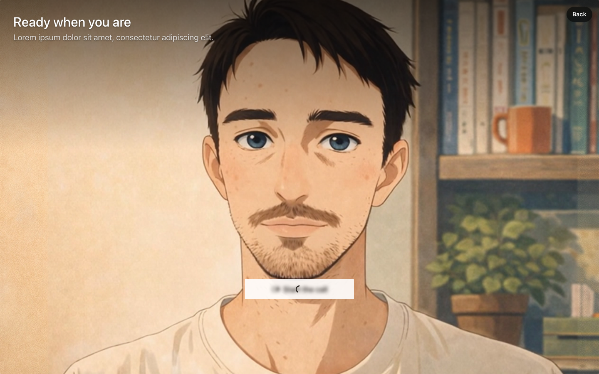

# Embed on a page of its own

A three-step flow where the call is the middle step and gets its own route. Step one is a short intake form (first name, a topic). Continue opens `/call`, which is nothing but `<tavus-embed layout="full-screen">` filling the viewport, with a step chip and a Back button over it. When the call ends the app moves to `/next-steps`, a page that uses what happened (the topic, the call length) and continues the journey. The conversation is created while the visitor is still on the form, so Continue joins a warm room and the call opens in under a second. Neutral placeholder brand and lorem ipsum copy.



## How it behaves


The recording types a name, picks a topic, presses Continue, lands on the full-screen call page already connecting, stays in the call while the agent speaks, leaves through the element's own control, and reaches the next-steps page with the topic and the call length filled in. The visitor's camera in the recording is a fake device.

## Run it

```bash
npm install
npm run dev
```

Paste your deployment id into `src/constants.ts` (create a deployment at [maker.tavus.io](https://maker.tavus.io) if you do not have one).

## What to look at

- One element for the whole app. `src/App.tsx` renders `<tavus-embed>` once, outside the routes, in a fixed full-viewport wrapper that is hidden on every route except `/call`. That is what makes the warm-up possible: `createConversation()` needs a mounted, ready element, and a per-page element would only exist once the visitor had already arrived.
- `layout="full-screen"` rearranges the element's preview for a surface that owns the viewport: the greeting sits top-left and the start button is centered above the lower edge. Sizing is still the page's; here the wrapper is `position: fixed; inset: 0`.
- `src/use-call.ts` wraps `TavusIntegration`. About a second after the name holds two or more characters it calls `createConversation()` once. Continue calls `startConversation()`, which joins that room; if the name or topic changed after the warm-up, Continue creates again first, because `conversational-context` and `custom-greeting` are read at creation. Every creation is a real conversation on the backend.
- Back on the call page calls `endConversation()`. That ends a live call, cancels a pending start, or ends the room that was created and never joined, so leaving the form after the warm-up does not leave a conversation running. The ended event that follows arrives when the route is already `/`, and the hook only routes to `/next-steps` for an ended event received on `/call`. `tavus:conversation-started` stamps the start time, so the next-steps page can show the call length.
- Finish on the next-steps page bumps a session counter that is the React key on the element's wrapper, so the next visitor gets a fresh element and preview.
- Leaving the page entirely also ends an unjoined room: the element does that on `pagehide`.

## Build it with a coding agent

Copy [the embed prompt](../embed-prompt.md) into your agent (Cursor, Claude Code, Lovable, Replit). It asks what you want to build, explains what `<tavus-embed>` can do, and points at the docs and these examples. Say you want to start from this one. The same prompt is behind the "Build this" button on the page.

## Stack

Vite, React 19, React Router 7, TypeScript, Oxlint.

Docs: [Embed](https://docs.tavus.io/sections/deployments/embed), [Host communication](https://docs.tavus.io/sections/deployments/host-communication).
