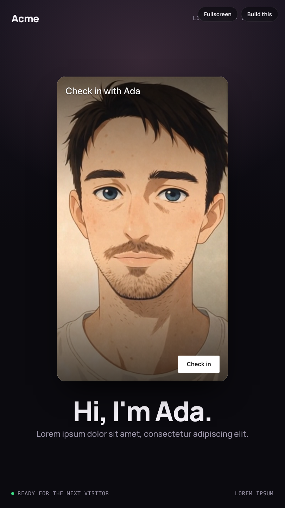

# Embed as a check-in totem (kiosk)

A portrait kiosk screen: dark branded background, the Tavus agent in a card in the middle with its own preview button relabelled Check in, and "Hi, I'm Ada." under it. A visitor walks up, taps Check in, talks, and a few seconds after the call the screen recreates the element so the next visitor gets the fresh preview.



The totem is 9:16. On a portrait display it fills the screen; on a landscape monitor it renders as a centered device-shaped column, which is how you will see it on a laptop.

## How it behaves


The recording taps Check in on the card, stays in the call while the agent speaks, ends it, and shows the element's after-call screen with the status line counting down to the reset. The visitor's camera in the recording is a fake device.

## Run it

```bash
npm install
npm run dev
```

Paste your deployment id into `src/constants.ts`. Use the Fullscreen button in the top-right corner when demoing on a laptop.

## What to look at

- `src/use-kiosk-session.ts` is the loop: `loading → attract → in-call → wrapping-up → (element recreated) → loading`. It wraps `TavusIntegration`, only listens (the element's own button starts the call), and bumps a session counter 8 seconds after `tavus:conversation-ended`. The counter is the React key on the card, so bumping it unmounts the old element and mounts a fresh one.
- The card is the embed's native portrait shape: `aspect-ratio: 9 / 16` at just under `28rem` wide, which is where the element switches to its own portrait layout, so nothing is cropped and the call controls sit inside the card. `html { font-size: clamp(16px, 1.35dvh, 28px) }` scales that threshold and the element's type with the screen, so a 1080×1920 totem gets a large card instead of a phone-sized one.
- `src/App.tsx` composes the totem around the card without covering any of it: the preview bar, the call controls and the after-call screen are all the element's own. Nothing inside the element is styled.
- `src/constants.ts` sets an `override-config` that skips the device check, puts the check-in copy on the element's preview bar, and tints Magic Canvas cards with the page accent (`magic_canvas.accent_color`, 0.9.4+).
- The "Build this" drawer (top-right) holds the prompt for a coding agent. Text in `src/prompt.ts`.

## Deployment settings for a kiosk

In the Tavus portal, not in code: turn bot protection off for a kiosk in a staffed room, and keep the haircheck off. If the agent uses Magic Canvas cards on a portrait screen, open the page with `?kiosk=1` in the URL so tall cards scroll instead of being scaled down (Magic Grid opt-in, `@tavus/embed` 0.9.1+).

## Stack

Vite, React 19, TypeScript, Oxlint.

Docs: [Host communication](https://docs.tavus.io/sections/deployments/host-communication).
