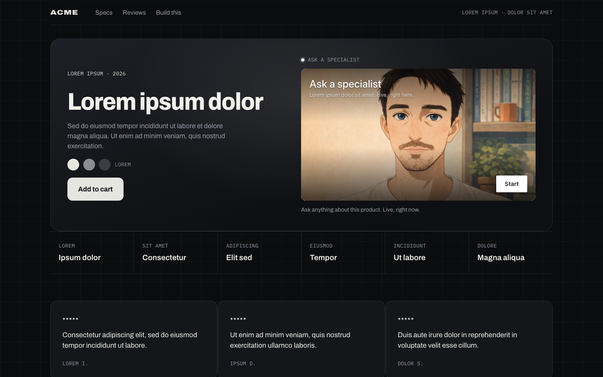

# Embed as a preview card that opens into a modal

A neutral product page (lorem ipsum copy) laid out as a hero banner: product copy on the left, the Tavus agent on the right as an "Ask a specialist" card. When the visitor presses Start, the card morphs into a centered modal over the whole page; when the call ends it morphs back. The page does none of that itself. It is one attribute on the element:

```html
<tavus-embed deployment-id="…" expand-options='{"enabled":true}'></tavus-embed>
```



## How it behaves


The recording presses Start in the card. The card morphs into a centered modal, the call runs there while the agent speaks, and when the call ends the modal shrinks back into the hero. The visitor's camera in the recording is a fake device.

## Run it

```bash
npm install
npm run dev
```

Paste your deployment id into `src/constants.ts` (create a deployment at [maker.tavus.io](https://maker.tavus.io) if you do not have one).

## What to look at

- `src/constants.ts` holds the `expand-options` JSON: `{ enabled: true }` opens a 16:9 modal. The other shapes (`aspect: "vertical"`, `fullscreen: true`, `enabled: false` to stay inline) are listed in the prompt. The attribute is observed, so setting it later updates the card; disabling it during a call collapses the modal.
- The card is about 560px wide. The modal animation starts from the card's box, so the size of the box is the size of the opening frame.

## expand-options keys

| Key | Type | Effect |
| --- | --- | --- |
| `enabled` | boolean | `true` expands on start, `false` keeps the call inline |
| `aspect` | `"horizontal"` \| `"vertical"` | 16:9 (default) or 9:16 card |
| `custom_aspect` | string | Ratio like `"4/3"`, overrides `aspect` |
| `fullscreen` | boolean | Edge to edge, ignores aspect and caps |
| `max_width`, `max_height` | number | Pixel caps for the expanded card |

`expand-options` is a regular attribute of `@tavus/embed`, documented in the [Embed reference](https://docs.tavus.io/sections/deployments/embed). The modal itself is a `<dialog>` inside the element's shadow root on the browser's top layer; the `<tavus-embed>` element stays in place in the page, which is why `overflow: hidden` on the card is safe.

## Build it with a coding agent

Copy [the embed prompt](../embed-prompt.md) into your agent (Cursor, Claude Code, Lovable, Replit). It asks what you want to build, explains what `<tavus-embed>` can do, and points at the docs and these examples. Say you want to start from this one. The same prompt is behind the "Build this" button on the page.

## Stack

Vite, React 19, TypeScript, Oxlint.

Docs: [Embed](https://docs.tavus.io/sections/deployments/embed).
