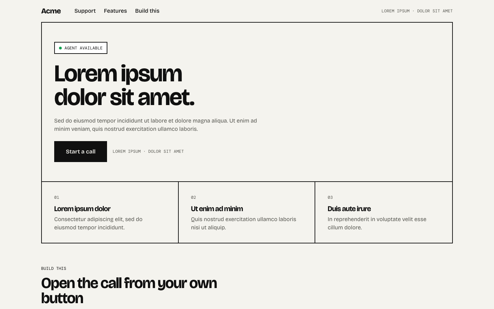

# Embed opened from your own button

A neutral support page (placeholder brand, lorem ipsum copy) where nothing from Tavus exists until the visitor presses the page's own "Start a call" button. On click the page mounts `<tavus-embed>` inside its own native `<dialog>`, waits for `tavus:ready`, and calls `startConversation()`. The modal carries the page's own status pill and suggested-question chips that send text into the conversation; ending the call is left to the element's own controls. Closing the modal unmounts the element, which ends the call.



## How it behaves


The recording presses the page's Start a call button. A native dialog opens with the element inside, the call starts without a second click, the status pill counts the time, and after the call the dialog shows the page's own outcome panel. The visitor's camera in the recording is a fake device.

## Run it

```bash
npm install
npm run dev
```

Paste your deployment id into `src/constants.ts`.

## What to look at

- `src/call-phase.ts` is the whole page state as one discriminated union: `idle | opening | starting | live | ended | error`. The element is mounted whenever the phase is not `idle`.
- `src/use-tavus-call.ts` creates `TavusIntegration` (exported by `@tavus/embed`) in an effect that runs once the element is mounted, subscribes to ready, started, ended and error, starts the call on `tavus:ready`, and exposes `open`, `close` and `ask`.
- `src/App.tsx` renders the `<dialog>` only while the element is mounted and calls `showModal()` in an effect. Escape closes it through `onClose`, the same path as the Close button.
- `src/constants.ts` passes `override-config` with `show_haircheck: false` so the call starts without a second click inside the modal.
- The "Build this" section is a prompt for a coding agent covering the mount-on-demand flow and the host API. Text in `src/prompt.ts`.

## Host API used

```ts
const tavus = new TavusIntegration("tavus-embed"); // after the element is in the DOM
tavus.on("tavus:ready", () => tavus.startConversation());
tavus.on("tavus:conversation-started", (e) => e.detail.conversationId);
tavus.sendMessage({ event_type: "conversation.respond", properties: { text } });
```

The same methods and events exist on the element itself for pages without a bundler.

## Stack

Vite, React 19, TypeScript, Oxlint.

Docs: [Host communication](https://docs.tavus.io/sections/deployments/host-communication).
