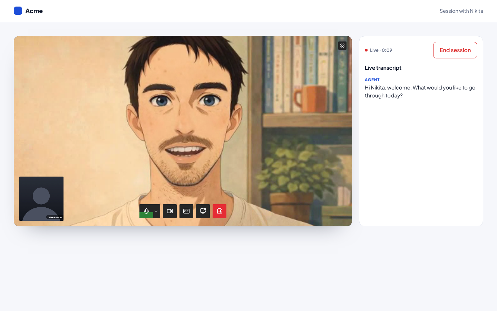

# Embed in a three-screen session flow

Intro, call, summary. The visitor types a first name and presses Start; the call screen shows the agent on the left and a live transcript on the right; when the call ends, a summary screen shows "Nice work, {name}", the duration, the full transcript, a Download .txt button and Back to start. Neutral placeholder brand and lorem ipsum copy.



## How it behaves


The recording types a first name, presses Start, stays in the call while the agent's greeting lands in the live transcript, presses End session, and reaches the summary with the duration and the transcript. The visitor's camera in the recording is a fake device.

## Run it

```bash
npm install
npm run dev
```

Paste your deployment id into `src/constants.ts`.

## What to look at

- The element is mounted once, from page load, inside a wrapper that is hidden outside the call screen. `tavus:ready` therefore fires while the visitor is still typing, and the Start click calls `startConversation()` directly. Starting from a click (not from inside the ready handler) is what keeps this example working on every published `@tavus/embed`.
- `src/constants.ts` turns the name into two attributes: `conversational-context` (per-call context for the agent) and `custom-greeting` (the agent's first line). They are set as the visitor types, so they are already on the element when Start is pressed.
- `src/session.ts` is the page state as one union (`intro | call | summary`) plus `readUtterance`, a guard that turns the untyped `tavus:protocol-message` detail into a transcript line for complete `conversation.utterance` events only, the same rule the element's chat panel uses. Streaming partials arrive under the same `event_type` with a boolean `properties.final` and are skipped.
- About a second after the visitor pauses on a name of two or more characters, `use-session.ts` calls `createConversation()` once per visit (`@tavus/embed` 0.14+): the room is created without joining, so Start joins a warm conversation. Measured locally the click-to-`conversation-started` gap drops from a few seconds to about 0.6 s. Every creation is a real conversation on the backend, including for visitors who type a name and leave, so typing never creates more than one, and `WARM_ROOM_WHILE_TYPING` in `src/constants.ts` turns the warm-up off entirely; the greeting and context are read at creation, so if the name changed before Start, Start creates the room again and the element ends the one nobody joined.
- `src/use-session.ts` wraps `TavusIntegration`: ready, started, ended, error and protocol events drive the screen and the transcript. Back to start bumps a session counter that is the React key on the element's wrapper, so the next session gets a fresh element.
- The "Build this" section at the bottom is the prompt for a coding agent. Text in `src/prompt.ts`.

## Stack

Vite, React 19, TypeScript, Oxlint.

Docs: [Host communication](https://docs.tavus.io/sections/deployments/host-communication).
