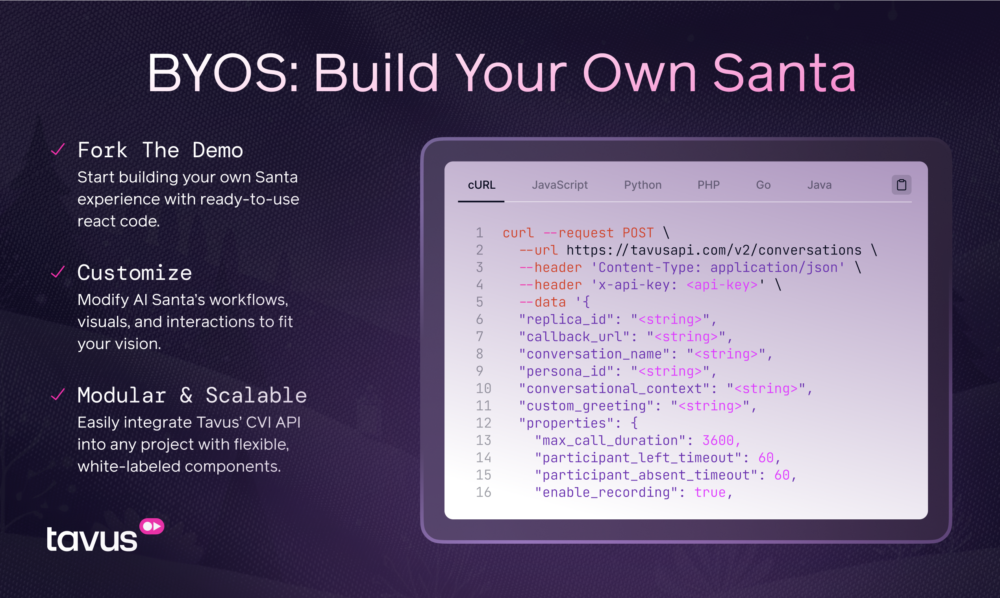

# Tavus Santa Demo  

## Build Your Own Santa  
Welcome to the Tavus Santa Demo, a holiday-themed showcase of [Conversational Video Interface (CVI)](https://docs.tavus.io/sections/conversational-video-interface/cvi-overview) technology. With this demo, you can create interactive, lifelike Santa Personas or use it as a foundation to build your own Conversational AI experiences.  

Start by forking the ready-to-use **Santa Demo** and explore Tavus CVI's real-time video interactions. Whether you need the classic Santa or a customized version, the demo provides all the building blocks to get started.  

<p align="center">
  
</p>  

<p align="center">
  <a href="https://stackblitz.com/github/Tavus-Engineering/tavus-examples/tree/main/showcase/santa-demo?file=src%2FApp.tsx" target="_blank">
    
  </a>
</p> 

---

## 🍴 **Forking & Running the Demo**  

1. **Install dependencies:**
   ```bash
   npm install
   ```

2. **Start the development server:**
   ```bash
   npm run dev
   ```
3. **OR** You can **fork and deploy** the Santa Demo in seconds with **StackBlitz** and start building your own Santa experience.  

<p align="center">
  <a href="https://stackblitz.com/github/Tavus-Engineering/tavus-examples/tree/main/showcase/santa-demo?file=src%2FApp.tsx" target="_blank">
    
  </a>
</p>  

---

## 🎨 **Customize Your Santa**  
Modify Santa's personality, visuals, and workflows to create your own version of the man in red. Whether you want **Vacation Santa**, **Cool Santa**, or something completely unique, Tavus Personas make it possible to put your own twist on the holiday favorite.

<br></br>

<p align="center">
  
  
</p>  


**With Tavus Personas, your imagination is the limit! you can explore and modify a variety of Santas:**  
- **Sad Santa**: A melancholy Santa who loves storytelling.  
- **Mad Max Santa**: Apocalypse-ready Santa in a post-holiday world.  
- **Vacation Santa**: Santa in flip-flops and sunglasses on a beach.  
---

## ⚙️ **How It Works**  

**What exactly is a Tavus Persona?**

A [Tavus Persona](https://docs.tavus.io/sections/conversational-video-interface/creating-a-persona) is a customizable AI character that defines the behavior, voice, and appearance of your digital agent. By specifying attributes such as the system prompt, context, and layers—including language models (LLMs) and text-to-speech (TTS) engines—you can tailor the Persona to fit specific roles, like a storyteller or customer service representative. This flexibility allows developers to create engaging, context-aware interactions within their applications. 

**With Tavus's APIs, you can:**

- **Create a Persona**: Start with Santa or create a completely new character (make sure to include santa's Replica ID: `r3fbe3834a3e` in your new Persona). Create a new Persona [via API](https://docs.tavus.io/api-reference/personas/create-persona) via API or in the [Tavus Platform](https://platform.tavus.io/personas/create).
- **Customize**: Edit your Persona’s greeting, conversation context, and more.  
- **Deploy**: Integrate the demo into any React project for a scalable experience.

**The Santa Demo stack includes:**
- React
- TypeScript
- Vite
- Tailwind CSS
- Framer Motion

---

## 🎨 **Customize Santa (and the conversation)**

Update the `persona_id` in the `createConversation.ts` file to use your new Santa variant or an entirely different character.  

Customize your webhook's setting to change Santa's personality personalize the greeting, adjust the conversation settings, and more! For example, to swap out the Persona, locate the following snippet in `createConversation.ts` and update the Persona ID:

   ```typescript
   body: JSON.stringify({
     // Replace with your own Persona ID
     persona_id: "p5317866", // Santa's unique persona ID in Tavus
     replica_id: "r79e1c033f", // Santa's unique replica ID
     conversation_name: "A Chat with Santa", // Name of the Santa-themed conversation
     conversational_context: "You are about to talk to Santa Claus, the jolly figure of holiday cheer...", // Adds context for the conversation
     custom_greeting: "Ho Ho Ho! Merry Christmas! How can Santa help you today?", // Santa's iconic greeting
     properties: {
       max_call_duration: 3600, // Maximum duration of the call in seconds (1 hour)
       participant_left_timeout: 60, // Time in seconds to wait after the participant leaves
       enable_recording: false, // Enable recording of the conversation
       enable_transcription: false, // Enable transcription of the conversation
       apply_greenscreen: false, // Apply green screen to applicable replicas
       language: "english", // Language for the conversation (30 avalible languages!)
     },
   }),

   ```

---

## 📚 **Learn More About Tavus**  

- [Developer Documentation](https://docs.tavus.io/)  
- [API Reference](https://docs.tavus.io/api-reference/)  
- [Tavus Platform](https://platform.tavus.io/)  
- [Creating a Persona](https://docs.tavus.io/sections/conversational-video-interface/creating-a-persona)  
